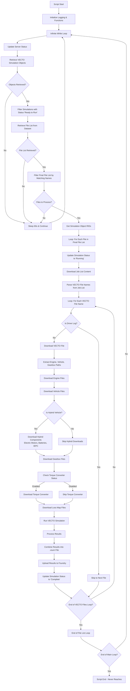

# diagrams

## Workflow

```mermaid
flowchart TD;
    A[Script Start] --> B[Initialize Logging & Functions]
    B --> C[Infinite While Loop]

    C --> D[Update Server Status]
    D --> E[Retrieve VECTO Simulation Objects]
    E --> F{Objects Retrieved?}

    F -->|No| G[Sleep 60s & Continue]
    F -->|Yes| H[Filter Simulations with Status 'Ready to Run']

    H --> I[Retrieve File List from Dataset]
    I --> J{File List Retrieved?}

    J -->|No| G
    J -->|Yes| K[Filter Final File List by Matching Names]

    K --> L{Files to Process?}
    L -->|No| G
    L -->|Yes| M[Get Simulation Object RIDs]

    M --> N[Loop: For Each File in Final File List]
    N --> O[Update Simulation Status to 'Running']
    O --> P[Download Job List Content]
    P --> Q[Parse VECTO File Names from Job List]

    Q --> R[Loop: For Each VECTO File Name]
    R --> S{Is Driver Log?}
    S -->|Yes| T[Skip to Next File]
    S -->|No| U[Download VECTO File]

    U --> V[Extract Engine, Vehicle, Gearbox Paths]
    V --> W[Download Engine Files]
    W --> X[Download Vehicle Files]

    X --> Y{Is Hybrid Vehicle?}
    Y -->|Yes| Z[Download Hybrid Components<br/>Electric Motors, Batteries, IEPC]
    Y -->|No| AA[Skip Hybrid Downloads]

    Z --> BB[Download Gearbox Files]
    AA --> BB

    BB --> CC[Check Torque Converter Status]
    CC -->|Enabled| DD[Download Torque Converter]
    CC -->|Disabled| EE[Skip Torque Converter]

    DD --> FF[Download Loss Map Files]
    EE --> FF

    FF --> GG[Run VECTO Simulation]
    GG --> HH[Process Results]

    HH --> II[Combine Results into .vsum File]
    II --> JJ[Upload Results to Foundry]
    JJ --> KK[Update Simulation Status to 'Complete']

    KK --> LL{End of VECTO Files Loop?}
    LL -->|No| R
    LL -->|Yes| MM[End of File List Loop]

    MM --> NN{End of Main Loop?}
    NN -->|No| C
    NN -->|Yes| OO[Script End - Never Reaches]

    G --> C
    T --> LL
```
